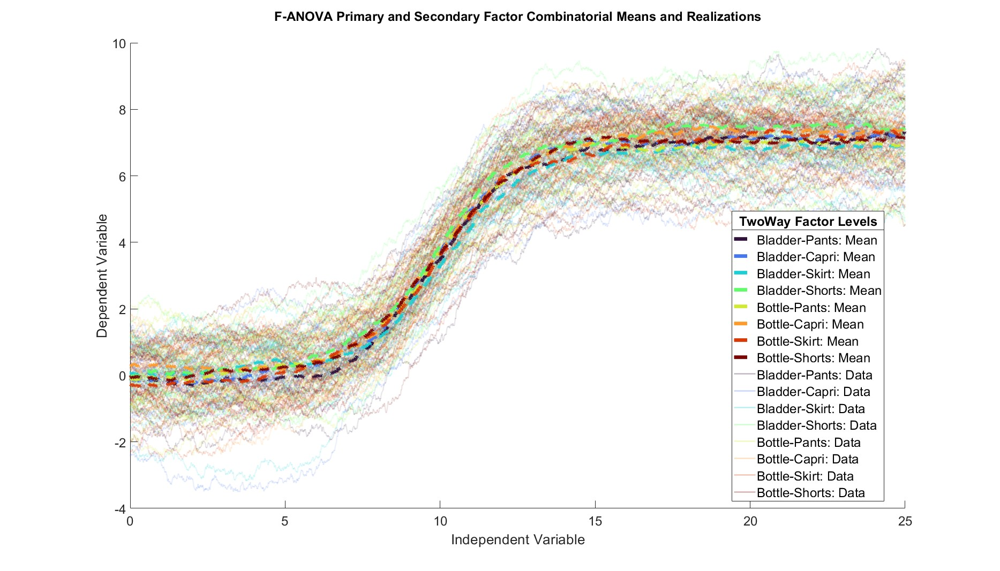

# F-ANOVA

## Functional Analysis of Variance (F-ANOVA)
Class and supporting functions to utilize an object oriented approach to F-ANOVA

## Description
Functional analyis of variance investigates whether categorical variables affect the mean response. OneWay ANOVA investigates how a single categorical variable with different levels affects the mean response. TwoWay ANOVA investigates how a two categorical variables, denoted Primary and Secondary Factors, each with different levels affects the mean response.

Run `help functionalANOVA` in MATLAB for full documentation

## Visuals
One Way Example:

Two Way Example:

## Installation
In the 'current folder' tab in MATLAB, right click on the entire repository, "Add to Path", then "Selected Folders and Subfolders".

## Usage
Please see the in-depth demo script:
[Demo Script](Documentation/FANOVA_Example.mlx)

## Support
Name: Adam C. Watts

Email: acwatts@lanl.gov

## Authors and acknowledgment
Thanks to Jin-Ting Zhang for his code which has been modified within this framework.
Thanks to Samuel Myren for his contribution on the OneWay ANOVA portions.

